### Java 的 GC 会释放内存给系统吗

测试环境为

```
openjdk 11.0.6 2020-01-14
OpenJDK Runtime Environment (build 11.0.6+10-post-Ubuntu-1ubuntu118.04.1)
OpenJDK 64-Bit Server VM (build 11.0.6+10-post-Ubuntu-1ubuntu118.04.1, mixed mode, sharing)
```

测试代码在 `codes/java-gc-release-mem-test/Test.java`

整个代码做的事情大概是，每一个循环都创建 `1024` 个大小为 `1 mb` 的 `byte` 数组，全部放入一个 `List` 中。之后 `sleep` 两秒后，我们把这个 `List` 所有的元素都设置成 `null`，从而让创建的所有 `byte` 数组都失去了引用。然后调用 `System.gc()`，这些失去引用的数组会被回收。

在不同的垃圾回收器下，使用 JProfiler 观察进程的 Heap 的空闲内存（绿色），使用内存（蓝色）。

+ `-XX:UseSerialGC`

    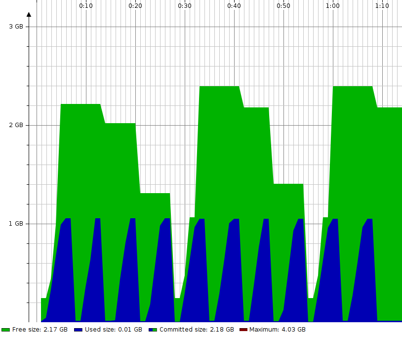

+ `-XX:UseParallelGC`

    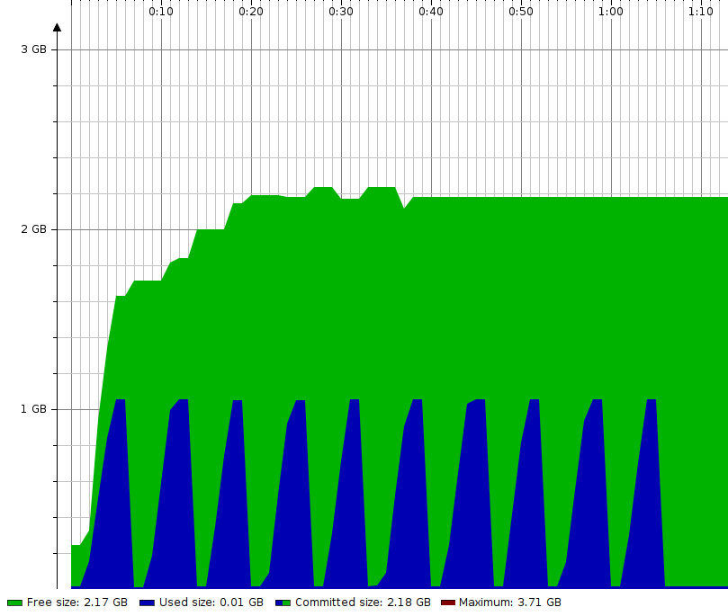

+ `-XX:UseConcMarkSweepGC`

    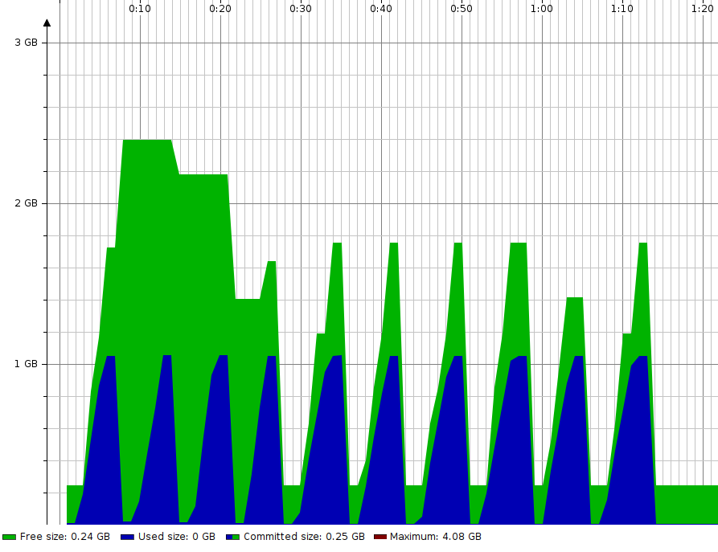

+ `-XX:UseG1GC`

    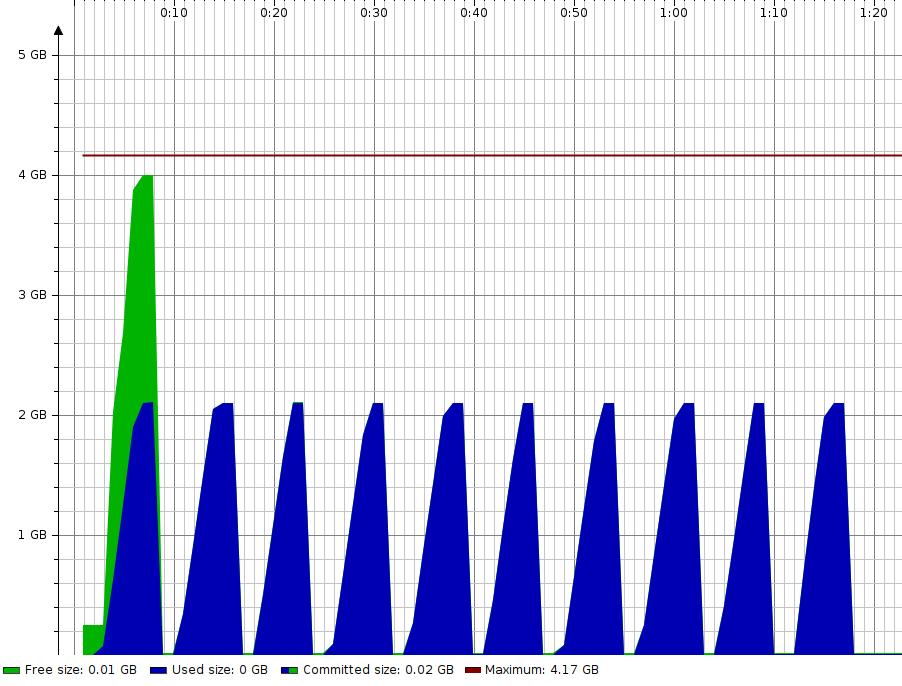

可以发现除了 `G1GC`，别的垃圾回收策略都不会在回收完内存后立刻把空闲空间返还给系统。

### 折线图

+ `-XX:UseSerialGC`

    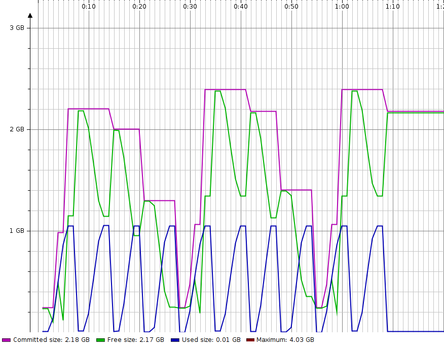

+ `-XX:UseParallelGC`

    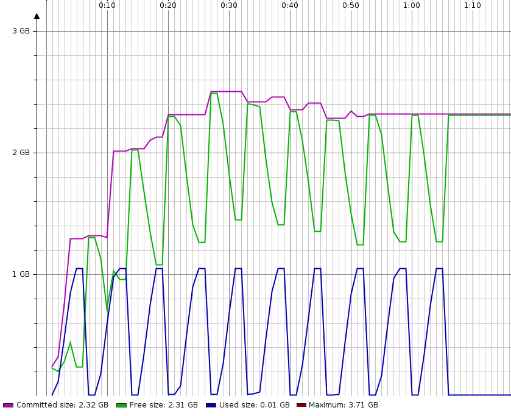

+ `-XX:UseConcMarkSweepGC`

    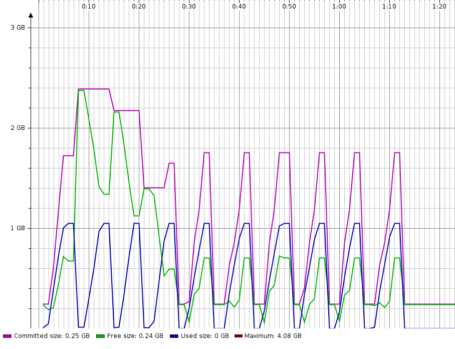

+ `-XX:UseG1GC`

    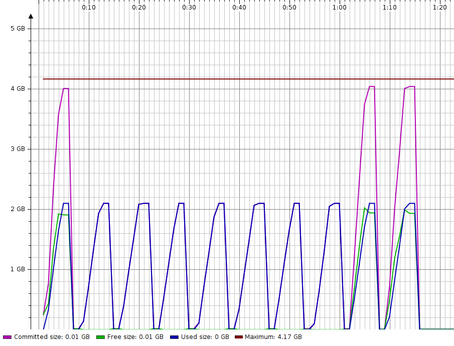

### `-XX:-ShrinkHeapInSteps`

另外一个相关的参数是 `-XX:-ShrinkHeapInSteps`。加上这个参数会禁用 `ShrinkHeapInSteps` 这个特性，它是用来使 Java 的堆渐近地缩小到目标大小，经过多次 GC 才到目标大小。禁用这个特性后，GC 会更具有侵略性地调整堆大小。

（堆的目标大小是由 `-XX:MaxHeapFreeRatio` 和 `-XX:MinHeapFreeRatio` 决定的。分别代表允许堆空闲的最大比例和最小比例。）

我们测试一下禁用 `ShrinkHeapInSteps` 的效果。

+ `-XX:-ShrinkHeapInSteps -XX:UseSerialGC`

    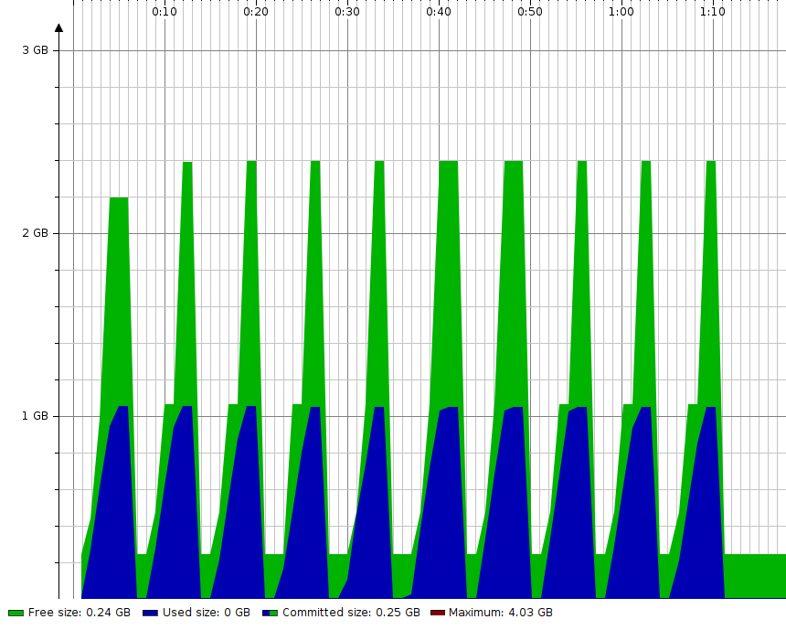

+ `-XX:-ShrinkHeapInSteps -XX:UseParallelGC`

    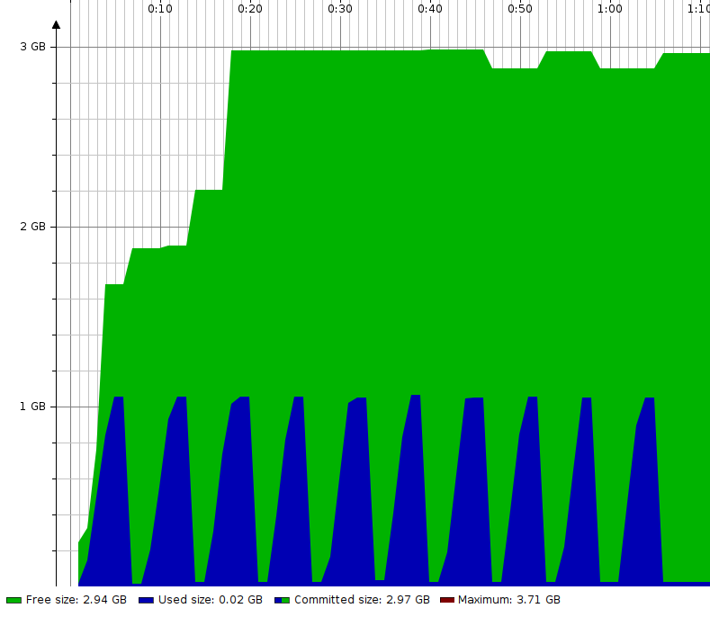

+ `-XX:-ShrinkHeapInSteps -XX:UseConcMarkSweepGC`

    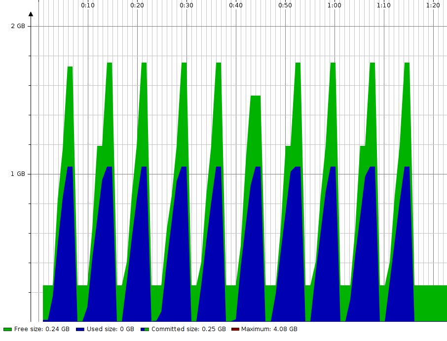

+ `-XX:-ShrinkHeapInSteps -XX:UseG1GC`

    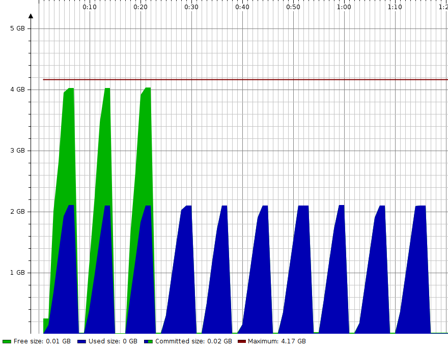

### 折线图

+ `-XX:UseSerialGC`

    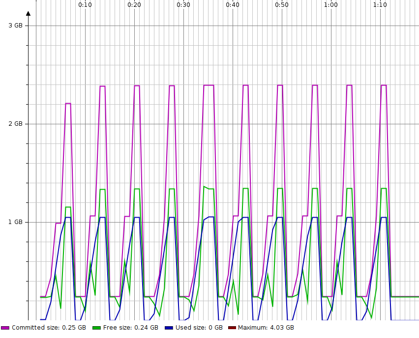

+ `-XX:UseParallelGC`

    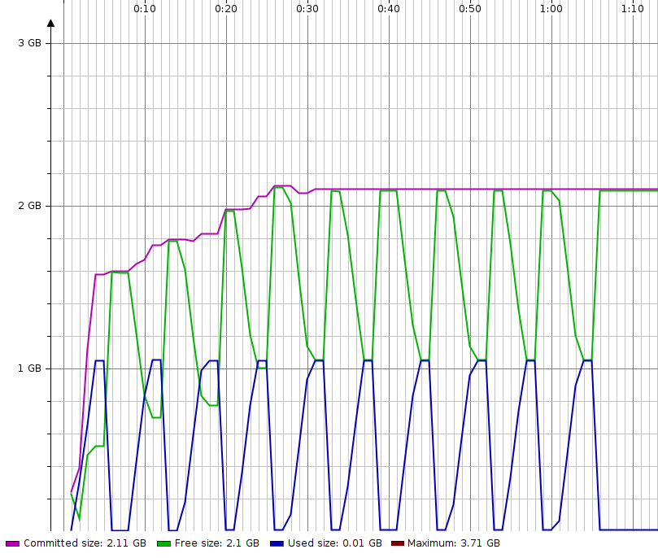

+ `-XX:UseConcMarkSweepGC`

    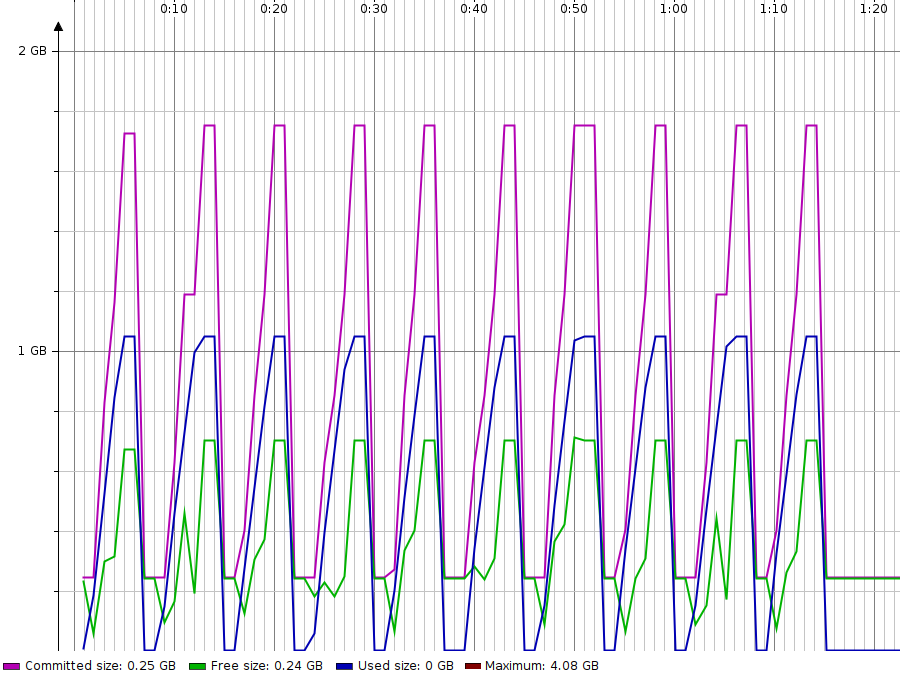

+ `-XX:UseG1GC`

    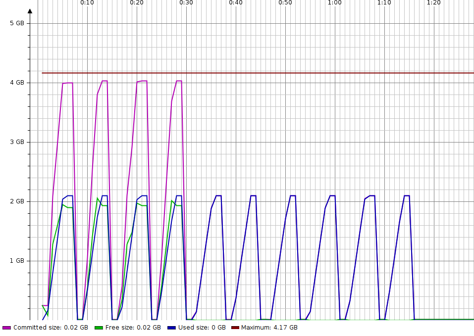

可以发现除了 `ParallelGC` 以外，另外集中策略都在 `System.gc()` 后归还了绝大部分的内存。

不会归还 OS 的内存，这是 `ParallelGC` 的特性。（"As we can see, the unused RAM is not released back to the OS. The JVM with Parallel GC keeps it forever, even disregarding the explicit Full GC calls."）

基于以上的观察，JVM 的内存表现和使用的 GC 策略，以及包括 `ShrinkHeapInSteps`，`MaxHeapFreeRatio` 和 `MinHeapFreeRatio` 这些参数的设置都有很大的关系。

### ShanandoahGC

`ShenandoahGC` 是 JDK12 推出的基于 Region 设计的全新垃圾回收器。它非常大的不同就是：`ShenandoahGC` 不需要 Full GC 就能异步回收不再使用的内存并归还给操作系统。 `Shenandoah` 在探测到可用内存后，几乎能够立即清理垃圾然后把这部分内存归还给操作系统。

### Remark

折线图和面积图不是同一次测试的数据，会有一些区别

### 参考资料

https://developer.ibm.com/javasdk/2017/09/25/still-paying-unused-memory-java-app-idle/

https://dzone.com/articles/choosing-the-right-gc

https://club.perfma.com/article/232210