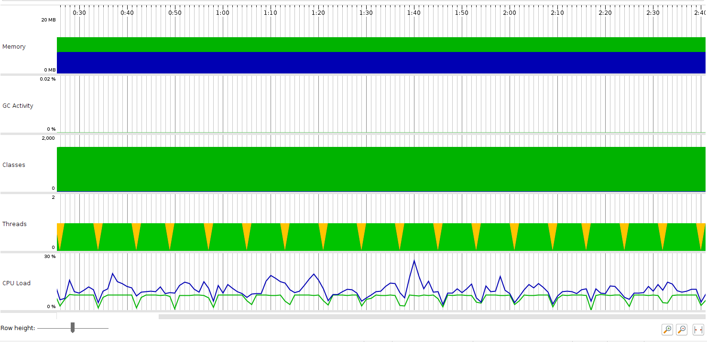
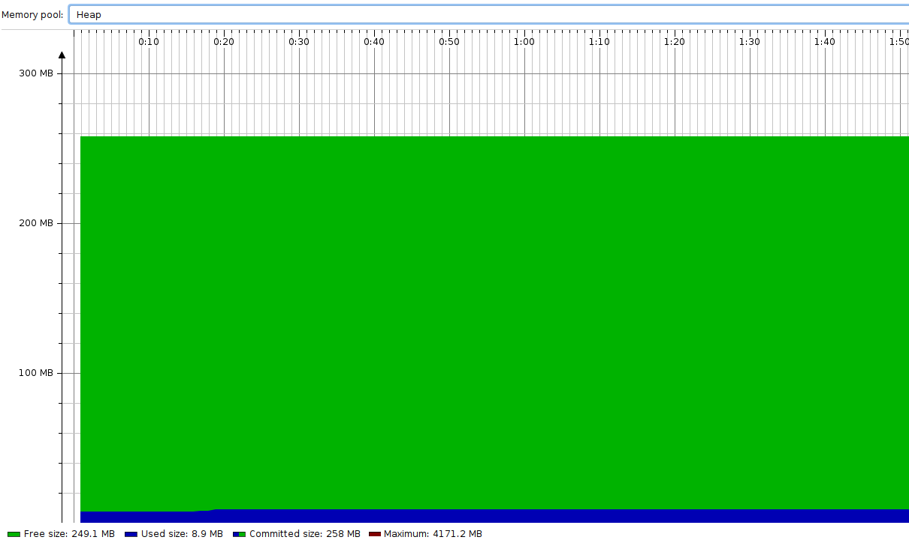
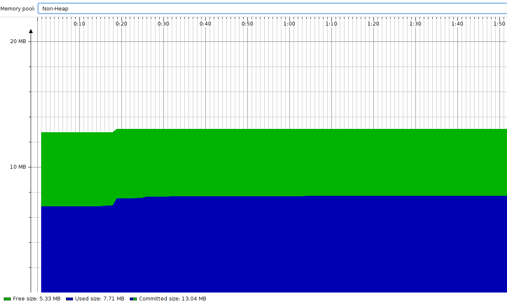
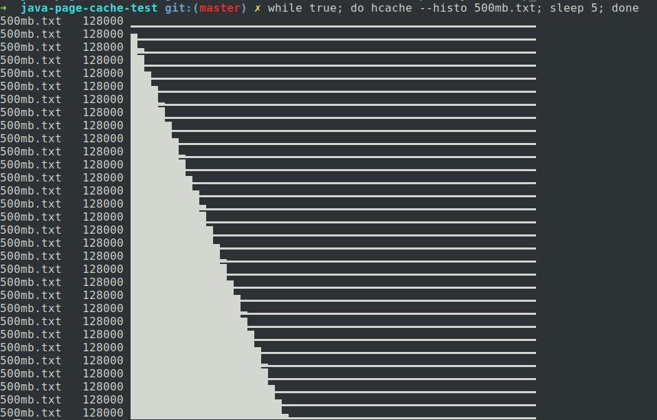

### Page Cache 会被计入 JVM 的内存吗

我们首先创建一个 `500 mb` 大小的文本文件 `dd if=/dev/zero of=100mb.txt bs=1M count=500`。这个时候我们先测试这个文件有多少被缓存到了 page cache，`hcache 500mb.txt`

```
+-----------+----------------+------------+-----------+---------+
| Name      | Size (bytes)   | Pages      | Cached    | Percent |
|-----------+----------------+------------+-----------+---------|
| 500mb.txt | 524288000      | 128000     | 128000    | 100.000 |
+-----------+----------------+------------+-----------+---------+
```

可以推断是 `dd` 在写文件的时候进行了一些缓存。我们手动清理掉 page cache，`sudo sh -c 'echo 3 > /proc/sys/vm/drop_caches'`，再运行 `hache 500mb.txt`，可以看到这个文件已经不在缓存中。

```
+-----------+----------------+------------+-----------+---------+
| Name      | Size (bytes)   | Pages      | Cached    | Percent |
|-----------+----------------+------------+-----------+---------|
| 500mb.txt | 524288000      | 128000     | 0         | 000.000 |
+-----------+----------------+------------+-----------+---------+
```

接着我们用以下代码来测试 Java 读取文件时的内存表现，代码在 `codes/java-page-cache-test/Test.java`

```
class Test {
    public static void main(final String[] args) throws IOException, InterruptedException {
        final File file = new File("./500mb.txt");
        final InputStream reader = new FileInputStream(file);
        final int inputSize = 10 * 1024 * 1024;
        // pause the console
        System.in.read();
        int result = 0;
        // read 20 mb per iteration
        for (int i = 1; result != -1; i++) {
            for (int j = 0; j < inputSize && result != -1; j++) {
                result = reader.read();
            }
            System.out.println(20 * i + " mb ...");
            Thread.sleep(1000);
        }
    }
};
```

这段代码每次读取 `20 mb` 文件内容，并不会储存读取的内容，以此排除其他内存使用对结果的干扰。我们同时用 JProfiler 和以下代码监控 JVM 的内存使用以及 page cache 的变化情况，

```
while true; do hcache --histo 500mb.txt; sleep 5; done
```

测试结果如下：

+ Overview

    

+ Heap Memory

    

+ Non-Heap Memory

    

+ Page Cache

    

运行中止后，运行 `hcache 500mb.txt`，可以看到一共缓存了差不多一半。

```
+-----------+----------------+------------+-----------+---------+
| Name      | Size (bytes)   | Pages      | Cached    | Percent |
|-----------+----------------+------------+-----------+---------|
| 500mb.txt | 524288000      | 128000     | 48700     | 038.047 |
+-----------+----------------+------------+-----------+---------+
```

通过上面的一些结果，可以发现 JVM 使用的内存基本没有变化，也就是说它并没有将 page cache 纳入自己的控制范围内。而从多次 `hcache` 的结果可以看出，page cache 的使用的确是在逐渐增加。可以推断的初步结论是，page cache 并不会被计入 JVM 的内存使用。

### 参考资料

https://betsol.com/java-memory-management-for-java-virtual-machine-jvm/#Java_JVM_Memory_Structure （JVM 的内存结构）

https://xiezhenye.com/2016/12/page-cache-%E9%80%A0%E6%88%90-java-%E9%95%BF%E6%97%B6%E9%97%B4-gc.html （一个 page cache 使 JVM 停止的例子）